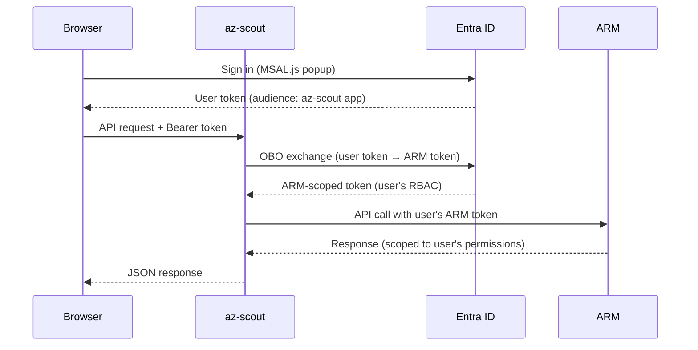

# On-Behalf-Of (OBO) Authentication

When deploying az-scout for **multiple users**, the On-Behalf-Of (OBO) flow lets each user sign in with their own Microsoft account. Azure ARM API calls are made with the **user's RBAC permissions** instead of the app's identity — so each user only sees the subscriptions and resources they have access to.

!!! info "When do I need OBO?"
    - **Single user / local dev**: Not needed. `az login` or managed identity is sufficient.
    - **Shared instance** (e.g. Azure Container Apps): **Recommended.** Each user signs in and sees only their own resources.

## How it works



## Setup

### 1. Create an App Registration

Create a multi-tenant App Registration in Entra ID:

```bash
# Login to Azure CLI
az login

# Create the app registration
az ad app create \
  --display-name "az-scout" \
  --sign-in-audience "AzureADMultipleOrgs" \
  --query "{appId: appId, objectId: id}" -o json
```

Note the `appId` — this is your **Client ID**.

### 2. Add a SPA redirect URI

In the [Azure Portal](https://portal.azure.com) → **App registrations** → your app → **Authentication**:

1. Click **Add a platform** → **Single-page application**
2. Add redirect URIs for your deployment:
    - Local dev: `http://localhost:5001`, `http://127.0.0.1:5001`
    - Production: `https://your-app.azurecontainerapps.io`

!!! warning "Use SPA, not Web"
    The redirect URI type **must** be "Single-page application", not "Web". MSAL.js uses the SPA auth code flow with PKCE.

### 3. Expose an API scope

In **Expose an API**:

1. Set the **Application ID URI** to `api://<CLIENT_ID>` (click "Set" next to "Application ID URI")
2. Click **Add a scope**:
    - Scope name: `access_as_user`
    - Who can consent: **Admins and users**
    - Admin consent display name: `Access Azure resources as user`
    - Admin consent description: `Allow az-scout to access Azure resources on behalf of the signed-in user`
3. Click **Add scope**

### 4. Pre-authorize Azure CLI (optional, for MCP)

To allow MCP clients to authenticate via `az account get-access-token`:

```bash
# Get the scope ID
SCOPE_ID=$(az ad app show --id <CLIENT_ID> \
  --query "api.oauth2PermissionScopes[0].id" -o tsv)

# Pre-authorize Azure CLI
az rest --method PATCH \
  --url "https://graph.microsoft.com/v1.0/applications(appId='<CLIENT_ID>')" \
  --body "{\"api\":{\"preAuthorizedApplications\":[{\"appId\":\"04b07795-8ddb-461a-bbee-02f9e1bf7b46\",\"delegatedPermissionIds\":[\"$SCOPE_ID\"]}]}}"
```

### 5. Create a client secret

In **Certificates & secrets** → **New client secret**:

1. Add a description (e.g. `az-scout OBO`)
2. Set expiration
3. Copy the **Value** (not the ID) — this is your **Client Secret**

### 6. Grant ARM API permission

In **API permissions**:

1. Click **Add a permission** → **Azure Service Management** → **Delegated permissions**
2. Check `user_impersonation`
3. Click **Grant admin consent** (requires Global Administrator)

## Configuration

Set these environment variables on your az-scout instance:

| Variable | Description | Required |
|----------|-------------|----------|
| `AZ_SCOUT_CLIENT_ID` | App Registration Client (Application) ID | **Yes** |
| `AZ_SCOUT_CLIENT_SECRET` | App Registration Client Secret | **Yes** |
| `AZ_SCOUT_TENANT_ID` | Home tenant ID of the App Registration | Optional (defaults to `organizations`) |

Example:

```bash
export AZ_SCOUT_CLIENT_ID="c61acc97-6a12-4173-b001-6ce31f6fc525"
export AZ_SCOUT_CLIENT_SECRET="your-secret-here"
export AZ_SCOUT_TENANT_ID="4140d426-ef7b-4d54-898e-d617ef5335ec"

az-scout web
```

When these variables are set, az-scout:

- Shows a **Sign in with Microsoft** screen on load
- Requires authentication for all API calls
- Uses the signed-in user's RBAC permissions for ARM calls
- Falls back to `DefaultAzureCredential` in CLI mode (`az-scout chat`, `az-scout mcp`)

## Multi-tenant access

Users from **any Entra ID tenant** can sign in (the app uses `AzureADMultipleOrgs` audience). After signing in, users can switch tenants using the tenant dropdown.

### Admin consent

When a user first switches to a new tenant, they may see an **"Admin Consent Required"** screen. A tenant administrator must grant consent by visiting the provided URL:

```
https://login.microsoftonline.com/<TENANT_ID>/adminconsent?client_id=<CLIENT_ID>
```

### MFA-required tenants

If a tenant's Conditional Access policy requires MFA for Azure Management access, az-scout handles this automatically:

1. The initial OBO exchange fails with `AADSTS50076`
2. az-scout shows an "Authenticate with MFA" prompt
3. The user completes MFA in a popup
4. If the OBO claims challenge can't be relayed, az-scout falls back to **direct ARM token acquisition** — the user gets an ARM token directly (which triggers MFA natively), and az-scout uses it as-is (without OBO)

## MCP authentication

When OBO is enabled, MCP clients must also authenticate. For VS Code:

```json
{
    "inputs": [
        {
            "type": "promptString",
            "id": "az-scout-token",
            "description": "Bearer token",
            "password": true
        }
    ],
    "servers": {
        "az-scout": {
            "url": "http://127.0.0.1:5001/mcp",
            "type": "http",
            "headers": {
                "Authorization": "Bearer ${input:az-scout-token}"
            }
        }
    }
}
```

Get the token:

```bash
az account get-access-token \
  --resource api://<CLIENT_ID> \
  --query accessToken -o tsv
```

!!! note "First-time consent for Azure CLI"
    If you get a consent error, run:
    ```bash
    az login --scope "api://<CLIENT_ID>/.default"
    ```
    Then retry the `get-access-token` command.

For a specific tenant:

```bash
az account get-access-token \
  --resource api://<CLIENT_ID> \
  --tenant <TENANT_ID> \
  --query accessToken -o tsv
```

!!! warning "Token expiry"
    Tokens expire after ~1 hour. When they do, restart the MCP server connection in VS Code and paste a fresh token.

## Security considerations

- **No app-level ARM access**: When OBO is enabled, `DefaultAzureCredential` is **never** used for web requests. All ARM calls require a user token.
- **Per-user isolation**: Each user's token is exchanged independently. Users only see resources matching their RBAC permissions.
- **CLI fallback**: `az-scout chat` and `az-scout mcp --stdio` still use `DefaultAzureCredential` since there's no browser for interactive login.
- **Token caching**: OBO tokens are cached per-user (keyed by full token hash + tenant) with 2-minute expiry margin. No cross-user cache pollution.
- **Session storage**: MSAL.js uses `sessionStorage` — tokens are cleared when the browser tab is closed.

## Troubleshooting

| Symptom | Cause | Fix |
|---------|-------|-----|
| Sign-in popup blocked | Browser popup blocker | Allow popups for the az-scout URL |
| `AADSTS65001` (consent required) | Admin consent not granted in target tenant | Ask tenant admin to visit the consent URL |
| `AADSTS50076` (MFA required) | Tenant CA policy requires MFA | Click "Authenticate with MFA" — az-scout handles this automatically |
| `AADSTS500131` (audience mismatch) | Frontend requesting wrong scope | Clear session storage and reload |
| Empty subscription list | User lacks Reader RBAC in this tenant | Assign at least Reader on a subscription |
| MCP tool returns "Authentication required" | Missing or expired Bearer token | Get a fresh token via `az account get-access-token` |
| `AADSTS650057` (invalid resource) | Azure CLI not pre-authorized | Run Step 4 above to pre-authorize the CLI client |
